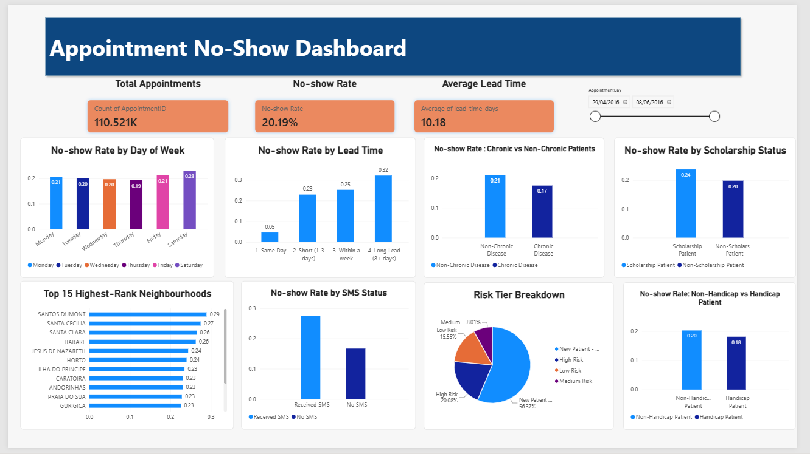

# **Medical Appointment No-Show Analysis**

## Project Overview

This project analyses medical appointment attendance patterns using the Medical Appointment No Shows dataset.

The main objective of this project is to explore factors that may be associated with patients missing their scheduled medical appointments.

The analysis was carried out using MySQL for data cleaning and exploratory data analysis, followed by Power BI for data visualisation and dashboard development.

## Dataset

The dataset used in this project is the Medical Appointment No Shows dataset from Kaggle.

Source: Kaggle – Medical Appointment No Shows

The dataset contains information about medical appointments, including patient demographics, appointment dates, health conditions, scholarship status, and whether the patient attended the appointment.

Some of the key variables include:

PatientId

AppointmentID

Gender

ScheduledDay

AppointmentDay

Age

Neighbourhood

Scholarship

Hipertension

Diabetes

Alcoholism

Handcap

SMS_received

No-show

## Tools Used

MySQL Workbench – Data cleaning and exploratory data analysis

SQL – Data transformation and analysis

Power BI – Data visualisation and dashboard development

Power Query – Additional data preparation

DAX – Creating calculated measures and KPIs

## Data Cleaning

Before starting the analysis, the dataset was cleaned using MySQL Workbench.

### 1. Date Formatting

The original ScheduledDay and AppointmentDay columns contained date and time values in a format that was not convenient for analysis.
These columns were transformed into a more structured date format to make it easier to perform time-based analysis.
This allowed the analysis to investigate:

Day of the week
Appointment timing
Lead time between scheduling and appointment

### 2. Duplicate Values

Duplicate records were identified and removed to ensure that each appointment was represented correctly in the analysis.

### 3. Invalid Age Values

The Age column contained values that were not logically meaningful, including negative ages.
These invalid records were identified and cleaned before conducting further analysis.

### 4. Data Validation

The remaining columns were also reviewed to identify inconsistent or unexpected values before beginning the exploratory analysis.

## Exploratory Data Analysis

After completing the data cleaning process, SQL was used to perform exploratory data analysis.

The analysis focused on the following questions:

### 1. What is our overall no-show rate?

The first step was to calculate the overall proportion of appointments where patients did not attend their scheduled appointment.

The no-show rate was calculated as:

No-Show Rate =

Number of No-Show Appointments
--------------------------------
**Total Number of Appointments**

This provides a baseline for understanding the overall level of missed appointments within the dataset.

### 2. Does the day of the week matter?

The analysis examined whether appointment attendance varied depending on the day of the week.

The AppointmentDay column was used to derive the day of the week, allowing no-show rates to be compared across different days.

The objective was to identify whether certain days were associated with different appointment attendance patterns.

### 3. Does lead time matter?

Lead time was calculated as the number of days between the scheduled date and the appointment date. To make the analysis easier to interpret, lead time was grouped into four categories:

Same Day: 0 days
Short: 1–3 days
Within a Week: 4–7 days
Long Lead: 8+ days

The no-show rate was then compared across these lead-time categories to identify differences in appointment attendance.

The analysis examined whether the amount of time between scheduling and the appointment was associated with the likelihood of a patient missing their appointment.

### 4. Do different age groups have different no-show rates?
To examine whether appointment attendance varies across different stages of life, patients were grouped into five age categories:

Child: 0–12 years
Teen: 13–19 years
Young Adult: 20–39 years
Adult: 40–59 years
Senior: 60+ years

The no-show rate was then compared across these age groups to identify differences in appointment attendance.
The analysis compared no-show rates between different age ranges to identify potential differences in appointment attendance patterns.

### 5. Do SMS reminders help?

The analysis examined the relationship between receiving an SMS reminder and appointment attendance.

No-show rates were compared between:

Patients who received an SMS reminder
Patients who did not receive an SMS reminder

The purpose was to investigate whether appointment attendance patterns differed based on SMS reminder status.

### 6. Which neighbourhoods have the highest risk?

The analysis examined no-show rates across different neighbourhoods.

To avoid drawing conclusions from neighbourhoods with very small appointment volumes, only neighbourhoods with at least 100 appointments were included in the comparison.

The neighbourhoods were then analysed based on their no-show rates to identify areas with relatively higher levels of missed appointments.

### 7. Does previous appointment history relate to current no-shows?

The analysis explored whether a patient's previous appointment history was associated with their likelihood of missing their current appointment.

Two aspects of previous appointment history were considered:

The number of previous appointments
The number of previous appointments that the patient had missed

This analysis aimed to investigate whether past attendance behaviour could provide useful context when analysing current appointment attendance.

### 8. Is there a relationship between handicap status and no-shows?

The analysis examined whether patients' handicap status was associated with their likelihood of missing an appointment.

No-show rates were compared across different handicap-status categories to identify differences in appointment attendance patterns.

### 9. Are patients with chronic disease more or less likely to miss their appointments?

Patients were classified based on whether they had at least one chronic condition.

For this analysis, chronic disease status was determined using conditions such as:

Hypertension
Diabetes

Patients were grouped into:

Chronic Disease
Non-Chronic Disease

No-show rates were then compared between these groups to investigate differences in appointment attendance patterns.

## 📈 Power BI Dashboard

Following the SQL analysis, the cleaned dataset was imported into Power BI to create an interactive dashboard.

The dashboard allows users to explore no-show patterns across different patient and appointment characteristics.

Key areas explored
Overall no-show rate
No-show rate by day of the week
No-show rate by lead time
No-show rate by age group
No-show rate by SMS reminder status
No-show rate by scholarship status
No-show rate by chronic disease status
No-show rate by handicap status
No-show rate by neighbourhood
Appointment history and previous no-show behaviour
Dashboard Preview

## Key Findings

The following section summarises the main insights identified during the analysis.

### Overall No-Show Rate

20.19% of appointments were missed.
This provides the overall baseline for comparing no-show rates across different patient and appointment characteristics.

### Day of the Week

No-show rates varied across different days of the week.
Saturday had the highest no-show rate, while Thursday had the lowest.

### Lead Time

No-show rates differed across the four lead-time categories: Same Day, Short (1–3 days), Within a Week (4–7 days), and Long Lead (8+ days).
Long Lead category had the highest no-show rate, while Same Day category had the lowest.

### Age Groups

No-show rates varied across the five age groups.
Teen group had the highest no-show rate, while Senior group had the lowest.

### SMS Reminders

The no-show rate differed between patients who received an SMS reminder and those who did not.
Received SMS group had a higher no-show rate than no-SMS group.

### Neighbourhood

Among neighbourhoods with at least 100 appointments, Santos Dumont had the highest no-show rate.
This comparison focuses on neighbourhoods with a sufficient number of appointments to make the rates more comparable.

### Handicap Status

No-show rates were compared between patients with and without a recorded handicap status.
Non-Handicap patients had a higher no-show rate.

### Chronic Disease

Patients were grouped into chronic disease and non-chronic disease categories based on hypertension and diabetes status.
The no-show rate was lower among chronic disease categories.

## Project Structure
medical-appointment-no-show-analysis/
│
├── README.md
│
├── data/
│   └── README.md
│
├── sql/
│   └── medical_appointment_analysis.sql
│
├── powerbi/
│   └── medical appointment no-show report.pbix
│
└── documentation/
    ├── exploratory-analysis.pptx
    └── dashboard_preview.png
    
## Project Objectives

Through this project, I aimed to develop practical experience in:

Data cleaning using SQL
Data validation
Exploratory data analysis
Working with dates and time-based data
Patient segmentation
Behavioural analysis
Calculating and interpreting no-show rates
Identifying patterns in appointment attendance
Data visualisation using Power BI
Communicating analytical findings through an interactive dashboard

 ## Power BI Dashboard

⚠️ Disclaimer

This project is intended for educational and portfolio purposes.

The analysis describes patterns observed within the dataset and does not establish causal relationships between patient characteristics and appointment attendance.
